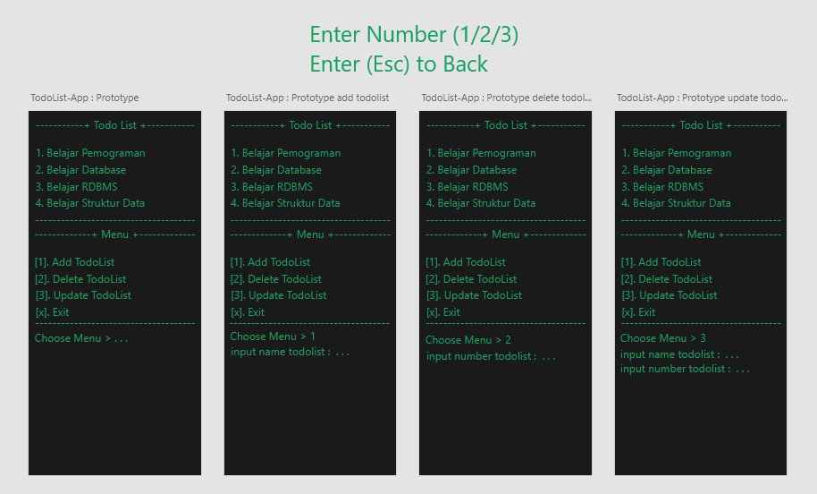

# **Todo List Project**
this is a todolist project using basic java

## **Run Program**
**.jar** stored in the target folder
  ```bash
  java -jar Todo-List-App-1.0.jar
  ```

## **Prototype TodoList Terminal** 
Link Prototype [Download](https://xd.adobe.com/view/fc8f25d4-5339-4f28-9be4-25ee40083979-a9dc/)




<br>

## **explanation Code**
  1. Data Model TodoList
      ```java
      public static String[] modelDataTodoList = new String[10];
      ```
  2. Business Logic TodoList
      ```java
        public static void showTodoList() {
          for (var i = 0; i < modelDataTodoList.length; i++) {
            var todo = modelDataTodoList[i];
            var number = i+1;

            if (modelDataTodoList[i] != null) System.out.println(number+". "+todo);
          }
        }


        public static void addTodoList(String todo) {
          for (var i = 0; i < modelDataTodoList.length; i++) {
            if (modelDataTodoList[i] == null) {
              modelDataTodoList[i] = todo;

              if (i == modelDataTodoList.length -1) {
                String[] temp = modelDataTodoList;

                modelDataTodoList = new String[modelDataTodoList.length * 2];
                for (var index = 0; index < temp.length; index++) {
                  modelDataTodoList[index] = temp[index];
                }
              }
              break;
            }
          }
        }


        public static boolean deleteTodoList(Integer number) {
          if ((number - 1) >= modelDataTodoList.length || modelDataTodoList[number-1] == null) return false;

          if (modelDataTodoList[number-1] != null) {
            modelDataTodoList[number-1] = null;

            if (modelDataTodoList[number-1] == null) {
              for (var i = number -1; i < modelDataTodoList.length; i++) {

                if (i == modelDataTodoList.length - 1) break;
                modelDataTodoList[i] = modelDataTodoList[i+1];
              }
            }
          }

          return true;
        }


        public static boolean updateTodoList(Integer number, String newTodolist) {
          if ((number-1) >= modelDataTodoList.length || modelDataTodoList[number-1] == null) {
            return false;
          }

          if (modelDataTodoList[number-1] != null) {
            modelDataTodoList[number-1] = newTodolist;
          }
          return true;
        }
      ```
  3. View TodoList
      ```java
      public static void viewMainTodoList() {
        while (stop) {
          System.out.println("-----------+ Todo List +-----------");
          showTodoList();
          System.out.println("-----------------------------------");
          System.out.println("-------------+ Menu +--------------");
          System.out.print("[1]. Add TodoList\n" +
                  "[2]. Delete TodoList\n" +
                  "[3]. Update TodoList\n" +
                  "[x]. Exit\n");
          System.out.println("-----------------------------------");
          System.out.print("Choose Menu > ");
          String choose = scan.nextLine();

          switch (choose) {
            case "1": viewAddTodoLits(); break;
            case "2": viewDeleteTodoList(); break;
            case "3": viewUpdateTodoList(); break;
            case "x": System.exit(0); break;
            default: System.err.println("Choose menu '"+choose+"' Not Found!"); break;
          }
        }
      }


      public static void viewAddTodoLits() {
        System.out.print("input name todolist : ");
        String todo = scan.nextLine();
        addTodoList(todo);
        System.out.println("\n\n");
      }


      public static void viewDeleteTodoList() {
        System.out.print("delete number todolist (x if cancel) : ");
        String deleteTodo = scan.nextLine();

        if (deleteTodo.equalsIgnoreCase("x")) {
          stop = false;
        }
        else {
          var success = deleteTodoList(Integer.valueOf(deleteTodo));
          if (!success) System.out.println("Fail Delete Number! "+deleteTodo+" Not Found\n\n");
          if (success) System.out.println("Success Delete Todo\n\n");
        }

      }


      public static void viewUpdateTodoList() {
        System.out.print("input new name todolist (x if cancel) : ");
        String newNameTodo = scan.nextLine();

        if (newNameTodo.equalsIgnoreCase("x")) {
          stop = false;
        } else {
          System.out.print("input update number todolist : ");
          String updateNumberTodo = scan.nextLine();

          boolean success = updateTodoList(Integer.valueOf(updateNumberTodo), newNameTodo);
          if (!success) System.out.println("Update Todo Fail! Number "+updateNumberTodo+" Not Found!\n\n");
          if (success) System.out.println("Update Todo Success\n\n");
        }
      }
      ```

  4. Main Program
      ```java
      public static void main(String[] xxx) {
        viewMainTodoList();
      }
      ```